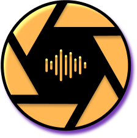

# AudioLens
 
<a id="readme-top"></a>
<h5 align="center" style="padding:0;margin:0;">Bladen Lehnberg</h5>
<h5 align="center" style="padding:0;margin:0;">221146</h5>
<h6 align="center">Interactive Development 300</h6>
<div align="center">
  <a href="https://github.com/Bladeyboy54/AudioLens">
    
  </a>

  <h3 align="center">Audio Lens </h3>

  <p align="center">
    AudioLens is an accessibility-focused mobile app designed for the visually impaired.
    <br />
    <br />
    <a href="https://github.com/Bladeyboy54/AudioLens/tree/main/audiolens"><strong>Explore the docs »</strong></a>
    <br />
    <br />
    <a href="https://youtu.be/Aze9V55X3bk">View Demo</a>
    ·
    <a href="bug report link">Report Bug</a>
    ·
    <a href="Maybe">Request Feature</a>
  </p>
  <br />
</div>


<details>
  <summary>Table of Contents</summary>
  <ol>
    <li>
      <a href="#about-the-project">About The Project</a>
      <ul>
        <li><a href="#built-with">Built With</a></li>
      </ul>
    </li>
    <li>
      <a href="#getting-started">Getting Started</a>
      <ul>
        <li><a href="#prerequisites">Prerequisites</a></li>
        <li><a href="#installation">Installation</a>
          <ul>
            <li><a href="#frontend-installation">Front-end Installation</a></li>
          </ul>
        </li>
      </ul>
    </li>
    <li><a href="#features">Features</a></li>
    <li><a href="#contributors">Contributors</a></li>
    <li><a href="#license">License</a></li>
    
  </ol>
</details>


## About the Project


AudioLens is a mobile app that empowers visually impaired users by transforming visual text into audio in real-time. Utilizing Google Cloud Vision for Optical Character Recognition (OCR) and Google’s Text-to-Speech (TTS) API, AudioLens allows users to take a photo or select an image to detect text, which is then read aloud for an accessible experience. The app provides an intuitive and accessible interface with large, easy-to-read buttons and high-contrast colors to accommodate users with low vision. It starts with a live camera, making it quick and easy for users to capture text, whether it's on a menu, a sign, or any document. AudioLens is an essential tool for anyone seeking assistance with reading text in their daily life, providing seamless navigation, simple controls, and a commitment to accessibility.

<p align="right">(<a href="#readme-top">back to top</a>)</p>


### Built With


## Getting Started

### Prerequisites

- [](https://code.visualstudio.com/)
- [](https://nodejs.org/en/download/prebuilt-installer/current)


### Installation

   #### Frontend Installation
1. Clone the frontend repo
   ```sh
   https://github.com/Bladeyboy54/AudioLens.git
   ```
2. Install the node modules for React Native
   ```sh
   cd audiolens
   ```
   then
   ```sh
   npm i
   ```
3. Create a file called .env
4. In the .env file add you Google Cloud SKD API Key
   ```env
   API_KEY=""
   ```
5. Start the application in your IDE Terminal
   ```sh
   npm start
   ```
   

   

   
<p align="right">(<a href="#readme-top">back to top</a>)</p>

## Features
#### 1. AI Intergration 
- Real-time Text Recognition: Starts with a live camera feed to capture text instantly or allows users to select an image from their gallery for text recognition.
- Text-to-Speech Conversion: Recognized text is converted into audio using Google’s Text-to-Speech (TTS) API, making it accessible for visually impaired users to hear the content.
- Cloud Integration for High Accuracy: Google Cloud Vision API enables high-accuracy OCR for diverse text formats, from printed documents to handwritten notes.
  
#### 2. User-Friendly UI
- Simple Navigation: Intuitive navigation flow between camera, image preview, and text recognition screens, with a back button to return and retake images as needed.
- High Accessibility Standards: Easy-to-read button text, large touch targets, and high-contrast color schemes designed with visually impaired users in mind.

#### 3. Manual inputs
- Supported File Types: Allows image input from both live camera captures and photo gallery selections, providing flexibility in how users capture text.
- Manual Text-to-Speech Control: Users can manually convert recognized text to speech, giving control over when to hear the content aloud.


### User Testing Results
| Question                                  | Average Rating | Notes                                                                    |
| :---------------------------------------- | :------------: | :----------------------------------------------------------------------- |
| Ease of navigation                        |   9/10         | Users found the interface intuitive and easy to navigate.                |
| Feature accessibility                     |   5/5          | All features were generally easy to locate.                              |
| Feature functionality                     |  9/10          | Minor improvements suggested for TTS screen layout.                      |
| Satisfaction with app experience          |  8.5/10        | UI simplification and accessibility efforts were well-received.          |
| Design (colors, font, layout)             |  9/10          | Positive feedback on color choice for accessibility.                     |
| Accessibility for visually impaired users |  8/10          | Accessibility features praised, with room to enhance text conversion UI. |

<p align="right">(<a href="#readme-top">back to top</a>)</p>

## Contributors

<div style="display: flex; flex-direction: row ; justify-content: space-between;">
  <div style="text-align: center;">
    <a href="https://github.com/BladeyBoy54/AudioLens">
      
    </a>
    <br>
    <sub>Bladen Lehnberg</sub>
  </div>
</div>

<p align="right">(<a href="#readme-top">back to top</a>)</p>

## Licence

Distributed under the MIT License. See `LICENSE.txt` for more information.

<p align="right">(<a href="#readme-top">back to top</a>)</p>

